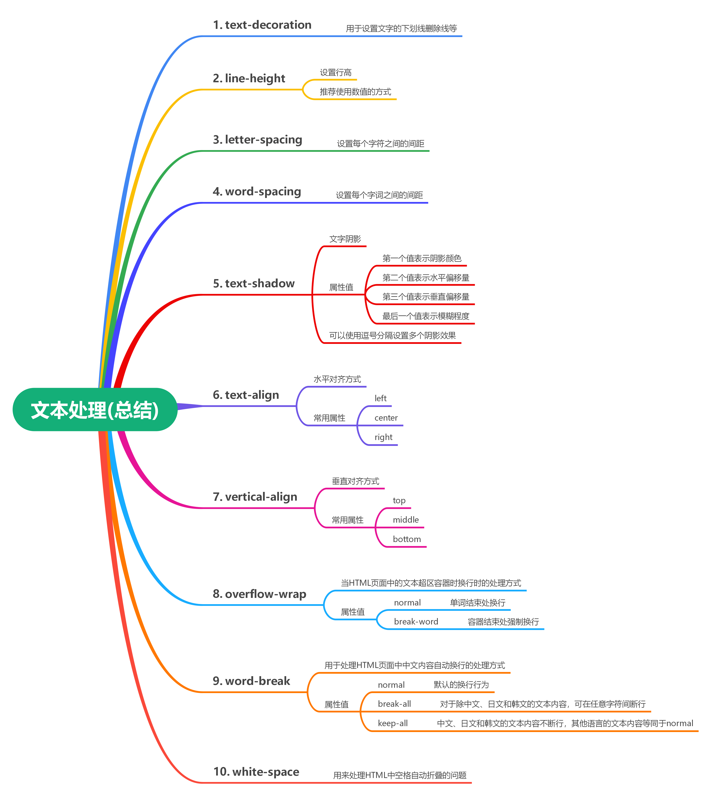

# 文本处理

## 写在前面

本篇文章我们将来学习CSS中对文本的处理，通过本篇文章的学习可以掌握的内容如下图所示：


## 文本装饰

在CSS中是通过`text-ecoration`属性来设置HTML页面中文本的装饰的（下划线、顶划线、删除线），该属性可以设置装饰线的类型（也就是下划线、顶划线等），还可以设置装饰线的颜色以及样式（实线、虚线等）。示例代码如下所示：

```html
<!DOCTYPE html>
<html lang="en">
    <head>
        <title>文字装饰</title>
        <style>
            p {
                /*
                    第一个属性，设置装饰线的类型，该属性可以设置如下四个值
                    * none 无效果
                    * line-through 删除线效果
                    * underline 下划线效果
                    * overline 顶部有一条线
                    第二个属性，设置装饰性的颜色，可以设置任何颜色值
                    第三个属性，设置线的类型，其值如下：
                    * solid 画一条实线
                    * double 画一条双实线
                    * dotted 画一条点划线
                    * dashed 画一条虚线
                    * wavy 画一条波浪线
                */
                text-decoration: underline #f0f double;
            }
        </style>
    </head>
    <body>
        <p>text-decoration属性</p>
    </body>
</html>

```


代码运行结果如下图所示：


`text-ecoration`属性其实是一个简写属性，可以将其拆分为如下三个属性：

- `text-decoration-line`属性：设置装饰线的类型

- `text-decoration-color`属性：设置装饰性的颜色

- `text-decoration-style`属性：设置线的类型

## 行高

CSS中是通过`line-height`属性来设置一行文字的高度，文字会在这个高度中居中。该属性的值有如下几种：

- 数字值：数字值会乘当前的字体大小作为行高（建议使用数字值）

- 长度值：可以设置具体的`px`值来作为行高

- 百分比：如果设置百分比的话，这个百分比会乘当前的字体大小作为行高

示例代码如下所示：

```html
<!DOCTYPE html>
<html lang="en">
    <head>
        <title>行高</title>
        <style>
            p {
                line-height: 2.5;
            }
        </style>
    </head>
    <body>
        <p>这是一段中文</p>
    </body>
</html>

```


代码运行结果如下图所示：


## 字符与字词间距

### 字符间距

CSS中提供的`letter-spacing`属性来用设置每个字符之间的间距，该属性的值除默认值`normal`外，还可以设置一个长度值，这个长度值为负数。示例代码如下所示：

```CSS
.first-example {
  letter-spacing: 0.4em;
}

.second-example {
  letter-spacing: 1em;
}

.third-example {
  letter-spacing: -0.05em;
}

.fourth-example {
  letter-spacing: 6px;
}

```


代码运行结果如下图所示：


### 字词间距

CSS中提供的`word-spacing`属性可以用来设置每个单词之间的间距，用法与`letter-spacing`属性类似。示例代码如下：

```CSS
.first-example {
  word-spacing: 15px;
}

.second-example {
  word-spacing: 5em;
}

```


代码运行结果如下图所示：


## 文字缩进

CSS中使用`text-indent`属性来设置HTML页面中的首行文字内容之前的缩进量（块级元素）。

如下示例代码展示了`text-indent`属性的用法：

```css
.example {
    text-indent: 5em;
}
```


代码运行结果如下图所示：


## 文字阴影

在CSS中使用`text-shadow`属性来制作文字的阴影效果，该属性的值可以传递4个，依次为颜色、水平偏移量、垂直偏移量和模糊程度。如下示例代码展示了`text-shadow`属性的用法：

```css
p {
    /* 
    第一个属性表示阴影颜色
    第二个属性表示水平偏移量
    第三个属性表示垂直偏移量
    第四个属性表示模糊程度
        */
    text-shadow: royalblue 10px 5px 3px;
}
```


代码运行结果如下图所示：


`text-shadow`属性还可以制造多重阴影的效果，只需要用逗号分割多个设置即可。如下示例代码展示了`text-shadow`属性多重阴影的用法：

```css
p {
    text-shadow: royalblue 10px 5px 3px, lightcoral -10px -5px 3px;
}
```


代码运行结果如下图所示：


## 水平对齐

CSS中使用`text-align`属性来实现文本的水平对齐方式，该属性常用的值有三个，分别是：

- `left`：表示左对齐（默认）

- `center`：表示居中对齐

- `right`：表示右对齐

如下示例代码展示了`text-align`属性的用法：

`css`

```css
body {
    margin: 0;
    padding: 20px;
}
p {
    background-color: lightcoral;
}
.p1 {
    text-align: left;
}
.p2 {
    text-align: center;
}
.p3 {
    text-align: right;
}
h3 {
    text-align: center;
}
```


`html`

```html
<body>
    <h3>左对齐</h3>
    <p class="p1">
        Don't be afraid to shoot a single horse. What about being alone and
        brave? You can cry all the way, but you can't be angry. You have to
        go through the days when nobody cares about it to welcome applause
        and flowers.
    </p>
    <h3>居中对齐</h3>
    <p class="p2">
        Don't be afraid to shoot a single horse. What about being alone and
        brave? You can cry all the way, but you can't be angry. You have to
        go through the days when nobody cares about it to welcome applause
        and flowers.
    </p>
    <h3>右对齐</h3>
    <p class="p3">
        Don't be afraid to shoot a single horse. What about being alone and
        brave? You can cry all the way, but you can't be angry. You have to
        go through the days when nobody cares about it to welcome applause
        and flowers.
    </p>
</body>
```


代码运行结果如下图所示：


## 垂直对齐

在CSS中使用`vertical-align`属性来设置文本（准确的说是内联元素或者表格）的垂直方向的对齐方式。

`vertical-align`属性常用的值也有三个，分别是：

- `top`：表示行内的顶部对齐，如果是表格的话则表示表格顶部

- `middle`：表示行内居中对齐

- `bottom`：表示底部对齐

> 关于表格和内联元素的内容，我们将会在后面进行学习。


如下示例代码展示了`text-align`属性的用法：

`css`

```css
span {
    font-size: 12px;
}
h1 {
    background-color: aquamarine;
}
.top span {
    vertical-align: top;
}
.middle span {
    vertical-align: middle;
}
.bottom span {
    vertical-align: bottom;
}
```


`html`

```html
<body>
    <h1 class="top">
        垂直对齐方式中的
        <span>❤</span>
        顶对齐
    </h1>
    <h1 class="middle">
        垂直对齐方式中的
        <span>❤</span>
        居中对齐
    </h1>
    <h1 class="bottom">
        垂直对齐方式中的
        <span>❤</span>
        底对齐
    </h1>
</body>
```


代码运行结果如下图所示：


## 文本换行

在CSS中处理文本换行的属性包含两个，分别是`overflow-wrap`属性和`word-break`属性。

### overflow-wrap属性

CSS中提供的`overflow-wrap`属性用于当HTML页面中的文本超区容器时换行时的处理方式，该属性包含两个值，分别是：

- `normal`：这个值是默认值，它会使在单词结束处换行

- `break-word`：这个属性会将单词在容器结尾处强制将单词分割

如下示例代码展示了`overflow-wrap`属性的用法：

`css`

```css
.text {
    width: 230px;
    background: lightcoral;
}

.break-word {
    overflow-wrap: break-word;
}
```


`html`

```html
<body>
    <p class="text">
        This is a test of English, it may be very long very
        longlonglonglonglonglonglonglong, this is to test out the final
        effect.
    </p>
    <p class="text break-word">
        This is a test of English, it may be very long very
        longlonglonglonglonglonglonglong, this is to test out the final
        effect.
    </p>
</body>
```


代码运行结果如下图所示：


### word-break属性

CSS中的`word-break`属性用于处理HTML页面中中文内容自动换行的处理方式。其属性值如下所示：

- `normal`：默认的换行行为

- `break-all`：对于除中文、日文和韩文的文本内容，可在任意字符间断行

- `keep-all`：中文、日文和韩文的文本内容不断行，其他语言的文本内容等同于`normal`

如下示例代码展示了`word-break`属性的用法：

`css`

```css
body {
    margin: 0;
    padding: 20px;
}
.text {
    width: 320px;
    background-color: lightcoral;
}

.normal {
    word-break: normal;
}

.breakAll {
    word-break: break-all;
}

.keepAll {
    word-break: keep-all;
}
```


`html`

```html
<body>
    <h3>1. word-break: normal</h3>
    <p class="normal text">
        This is a long and Honorificabilitudinitatibus
        califragilisticexpialidocious
        longlonglonglonglonglonglonglonglonglonglonglonglonglong
        ノドがかわくハラがへるなのにチカラがわいてくるキズがうずくアセがとぶだけ
    </p>

    <h3>2. word-break: break-all</h3>
    <p class="breakAll text">
        This is a long and Honorificabilitudinitatibus
        califragilisticexpialidocious
        longlonglonglonglonglonglonglonglonglonglonglonglonglong
        ノドがかわくハラがへるなのにチカラがわいてくるキズがうずくアセがとぶだけ
    </p>

    <h3>3. word-break: keep-all</h3>
    <p class="keepAll text">
        This is a long and Honorificabilitudinitatibus
        califragilisticexpialidocious
        longlonglonglonglonglonglonglonglonglonglonglonglonglong
        ノドがかわくハラがへるなのにチカラがわいてくるキズがうずくアセがとぶだけ
    </p>
</body>
```


代码运行结果如下图所示：


## 处理空格折叠

CSS中提供的`white-space`属性就是用来处理HTML中空格自动折叠的问题的，该属性中的值比较多，下表展示了各种值得情况：

| |换行符|空格和制表符|文字转行|
|---|---|---|---|
|`normal`|合并|合并|转行|
|`nowrap`|合并|合并|不转行|
|`pre`|保留|保留|不转行|
|`pre-wrap`|保留|保留|转行|
|`pre-line`|保留|合并|转行|
|`break-spaces`|保留|保留|转行|


> 上表出自MDN


## 总结

